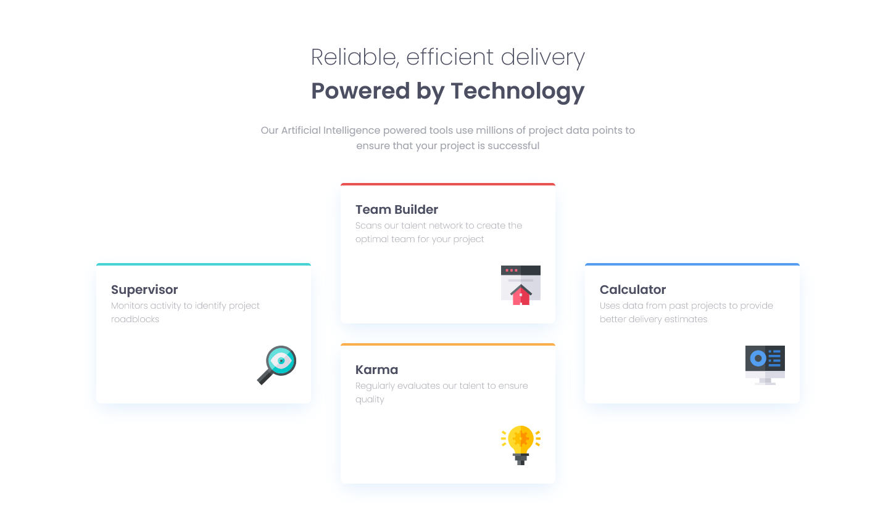

# Frontend Mentor - Four card feature section solution

This is a solution to the [Four card feature section challenge on Frontend Mentor](https://www.frontendmentor.io/challenges/four-card-feature-section-weK1eFYK). Frontend Mentor challenges help you improve your coding skills by building realistic projects.

## Table of contents

- [Overview](#overview)
  - [The challenge](#the-challenge)
  - [Screenshot](#screenshot)
  - [Links](#links)
- [My process](#my-process)
  - [Built with](#built-with)
  - [What I learned](#what-i-learned)
- [Author](#author)
- [Acknowledgments](#acknowledgments)

## Overview
It was a nice challenge. the flexbox was really helpful here. Making the layout responsive was so easy with flexbox
### The challenge

Users should be able to:

- View the optimal layout for the site depending on their device's screen size

### Screenshots

### Links

- Solution URL: [Add solution URL here](https://github.com/ajay0024/four-card-feature-section-master)
- Live Site URL: [Add live site URL here](https://ajay0024.github.io/four-card-feature-section-master)

## My process
I used flexbox with keeping in mind mobile-first workflow.

### Built with

- Semantic HTML5 markup
- CSS custom properties
- Flexbox
- Mobile-first workflow

### What I learned

This is a good example of how flexbox can make it easy to make responsive websites with minimal changes.

## Author

- Website - https://ajay0024.github.io/cv/
- Frontend Mentor - https://www.frontendmentor.io/profile/ajay0024
- Twitter - https://twitter.com/Python72000166

## Acknowledgments

This was inspirational. Will do more.
